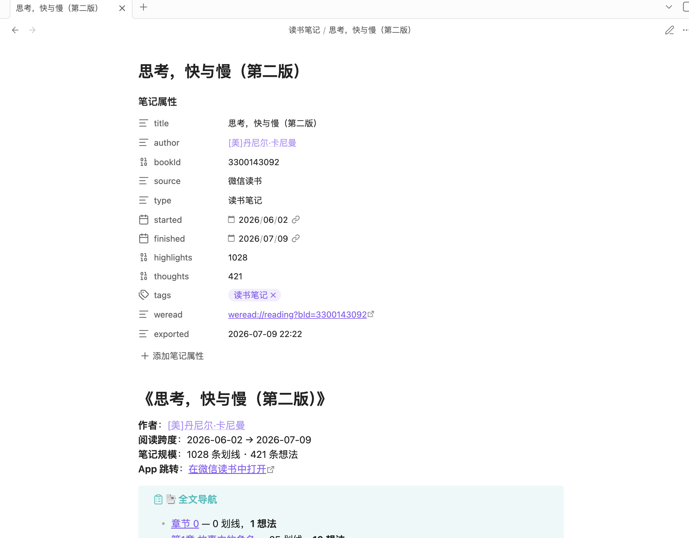
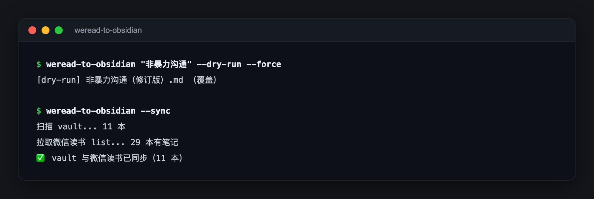

# weread-to-obsidian — 微信读书笔记，一条命令搬进 Obsidian

> 给同时重度使用微信读书和 Obsidian 的读书人的笔记同步 CLI，解决划线和想法困在 App 里、无法被本地知识库检索引用的问题。

## 为什么做这个

在微信读书里读了 33 本书、攒下 6500+ 条划线和想法之后，问题越来越明显：写东西想引用某段话，只记得"在某本书里见过"，得打开 App 一本本翻；Obsidian 里的知识库再完整，也检索不到这批数据。笔记的价值在于被反复调用，而不是躺在 App 里睡觉。所以做了这个：单文件 Python CLI，直连微信读书随官方 weread-skills 技能包开放的 Agent API（key 与 skill 通用），一条命令把一本书的全部划线、想法按章节结构落成 Obsidian 可直接检索、可双链引用的 Markdown，并让 vault 与 App 之间保持增量对账。

## 核心功能

- ✅ 一条命令导入整本书 —— `weread-to-obsidian 书名`，划线/想法按章节归位，带 frontmatter 的 Markdown 直接进 vault，立刻可检索、可双链引用
- ✅ `--sync` 增量对账 —— vault 与微信读书两边 diff（缺失 / 过期 / 孤儿三类），只刷新有变化的书，手动整理过的笔记位置不会被推翻
- ✅ 热门划线 + 高赞书友想法 —— 每本书附平台 Top-20 热门划线、每条最多 3 条高赞想法（按点赞过滤灌水），重读时能看到"大家在划什么"，和自己重合的标 ⭐
- ✅ `weread://` 深链 —— 笔记里每条划线一键跳回 App 内原文位置，Obsidian 与微信读书双向打通
- ✅ `--profile` 读者画像 —— 年度阅读趋势、24 小时阅读时段分布、偏好作者，写入受保护区块，重复运行不覆盖手写内容

## 效果展示

**生成的笔记在 Obsidian 中的样子** —— frontmatter 属性面板 + 笔记规模 + `weread://` 深链回 App：



单本导入与 `--sync` 对账实跑（2026-07-24）：



完整笔记结构可看 [examples/示例笔记.md](examples/示例笔记.md)。

## 我的书单（真实使用数据）

用这个工具已沉淀 11 本已读完书籍的笔记，这是其中几本：

| 书名 | 作者 | 划线 | 想法 |
|---|---|---|---|
| 思考，快与慢（第二版） | 丹尼尔·卡尼曼 | 1028 | 421 |
| 影响力（全新升级版） | 罗伯特·西奥迪尼 | 1343 | 240 |
| 非暴力沟通（修订版） | 马歇尔·卢森堡 | 509 | 120 |
| 纳瓦尔宝典 | 埃里克·乔根森 | 594 | 160 |
| 精英的人格魅力课 | 奥利维娅·福克斯·卡巴恩 | 912 | 200 |
| 如何成为不完美主义者 | 斯蒂芬·盖斯 | 679 | 122 |
| 富爸爸穷爸爸 | 罗伯特·清崎 | 488 | 91 |
| 认知觉醒 | 周岭 | 328 | 14 |

**在读**

| 书名 | 作者 | 划线 | 想法 |
|---|---|---|---|
| 穷查理宝典：查理·芒格智慧箴言录 | 彼得·考夫曼 | 114 | 33 |
| 哈佛经典谈判术 | 迪帕克·马尔霍特拉 / 马克斯·巴泽曼 | 86 | 40 |

## 快速开始

```bash
git clone https://github.com/ZhongJiaqi/weread-to-obsidian.git
cd weread-to-obsidian && ./install.sh                 # 装到 ~/.local/bin
WEREAD_API_KEY=wrk-你的key weread-to-obsidian --list  # 列出所有有笔记的书
```

| 环境变量 | 必需 | 用途 |
|---|---|---|
| `WEREAD_API_KEY` | 是 | 微信读书 Agent API 的 Bearer token（`wrk-` 开头）。获取方式见 [weread-skills](https://cdn.weread.qq.com/skills/weread-skills.zip) 的 SKILL.md；已在 Claude Code / Cursor 用过 weread-skills 的直接复用。建议写进 `~/.zshenv` 让非交互 shell 也能读到 |
| `WEREAD_VAULT` | 否 | vault 路径，默认 macOS iCloud 的 Obsidian 目录 |
| `WEREAD_SUBDIR` | 否 | vault 内子目录，默认 `读书笔记` |

常用命令：

```bash
weread-to-obsidian "非暴力沟通"        # 导入一本（书名部分匹配或 bookId）
weread-to-obsidian --all               # 批量导入已读完的书（--include-reading 含在读）
weread-to-obsidian --sync              # 对账报告（默认 dry-run，--apply 执行）
weread-to-obsidian --profile           # 更新读者画像
```

## 技术方案（简）

Python 3 单文件，只用标准库（`urllib` / `argparse` / `re`），无 requests、无 PyYAML。所有请求直连微信读书官方 Agent API Gateway——即 weread-skills 技能包背后的同一套接口（Bearer 认证，每次请求带 `skill_version`）。数据流：拉取有笔记的书单 → 逐本拉划线/想法/热门划线 → 按章节组装 Markdown（YAML frontmatter + 目录 + 深链）→ 写入 vault；frontmatter 字段是 Obsidian Bases / Dataview 视图的稳定契约。76 个单元测试，CI 跑 `unittest`。

## 设计取舍

1. 在「synckey 分页」和「count=2000 一次拉全」之间选了后者（`4f2a109`）：实测 synckey 是增量同步游标、不回填历史，308 条想法的书会永远卡在 200 条；代价是每次全量拉取，用流量换正确性。
2. 在「`--all --force` 全量刷」和「`--sync` 三桶 diff」之间选了 `--sync` 作为日常路径（`842b892`）：全量刷会覆盖手改笔记、浪费 API 调用；代价是要维护 vault 扫描与字段对账逻辑（为此单写了 24 个测试）。
3. 标准库零依赖：`install.sh` 拷一个文件即完成安装，无 venv 无 pip；代价是 frontmatter 只能用正则手写解析。

## Roadmap

- [ ] 思考画像：对全部想法做语义聚类，生成"我在思考什么"仪表盘
- [ ] 主题聚合 v2：词典匹配版因信号太弱已移除，计划改用 LLM 语义聚类重做

## 隐私 & 安全

只在本地运行，无遥测；API key 仅用于鉴权调用 `i.weread.qq.com`；笔记内容只落在你的本机与 vault。

## License

MIT — 见 [LICENSE](LICENSE)
